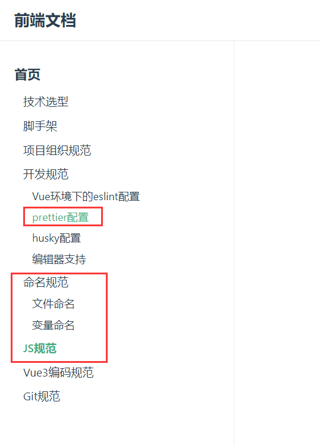

## 前端开发规范

#### 1、公司前端开发规范

公司前端规范地址：https://frontend-docs.urithub.com/ 

账号：urit

密码：urit

以上地址只需要阅读下图红线框的内容




### 2、项目组织结构

```
├─index.html
├─README.md
├─vite.config.js - 项目配置，如何配置请参考旧项目，或者阅读vite官网
├─src
|  ├─App.vue
|  ├─main.js
|  ├─views - 页面文件夹，一类页面放一个文件夹，入口页面用index.vue命名，
|  |   ├─qc
|  |   | ├─components
|  |   | | ├─edit.vue
|  |   | ├─index.vue
|  |   ├─home
|  |   |  ├─index.vue
|  ├─utils -辅助函数文件夹
|  |   └utils.js
|  ├─stores - 状态管理文件夹
|  |   └userStore.js
|  ├─router - 路由文件夹
|  |   └index.js
|  ├─lib
|  |  └charts.es.js
|  ├─layouts -应用整体布局文件夹
|  |    ├─main
|  |    |  ├─Index.vue
|  |    |  ├─main-footer.vue
|  |    |  ├─main-header.vue
|  ├─css
|  ├─components -通用组件
|  |     ├─input
|  |     |   ├─input-name.vue
|  |     |   ├─keyboard-input.vue
|  |     ├─base
|  |     |  └notinfo.vue
|  ├─axios -后台api请求目录，每一类请求用一个文件存放
|  |   ├─config.js
|  |   ├─machine.js
|  |   └user.js
|  ├─assets
|  |   ├─logo.svg

```


### 3、静态图片访问规范（重要）

###### 注意：访问强度静态图片需要用 点+斜杠  './' 开头来访问，不能使用  '/'，否则在二级域名部署的时候会找不到文件。

```
<van-image
    width="28px"
    fit="cover"
    position="left"
    src="./icon/warehouse.svg"/>
```

###### 同时在vite.config.js里面需要加上 配置base:"./"

```
export default defineConfig({
    plugins: [
        vue(),
    ],
    base:"./", //加上这个配置
    server: {
      ...
    },
})

```


#### 4、代码提交规范

代码提交需要对本次的修改做简要的描述，禁止用"代码提交"、“Bug修复” 等于没说的描述

例如：如果有多个修改点，使用1、2、3 列出来，没行一个修改点

```
1、解决每日清洗刚点击就显示已完成
2、新建计算项时默认勾选此选项
3、已启用的微球批次隐藏“启用”按钮
4、样本列表需要能过滤出未审核的样本
```


#### 5、CSS规范

所有项目引入quasar.css内置的样式进行布局，尽量不自己写样式，quasar.css获取方式，找一个安装过quasar的项目，在node_modules里面把css文件拷入自己的项目：front\node_modules\quasar\dist\quasar.css，然后在main.js里面引入

main.js

```
...
import './css/quasar.css'
...
```


