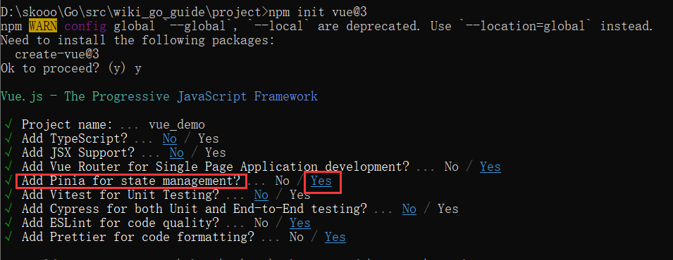
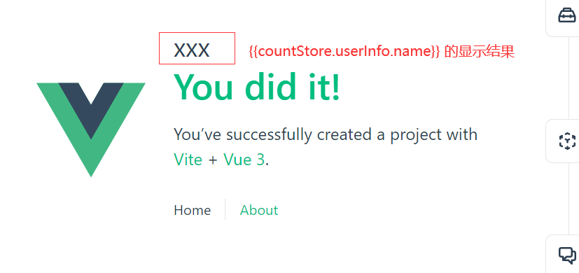

## 1、项目组使用到的技术栈及UI框架

Vue3：https://cn.vuejs.org/  易学易用，性能出色，适用场景丰富的 Web 前端框架。

Vue Router: https://router.vuejs.org/zh/introduction.html  是 Vue.js 的官方路由。它与 Vue.js 核心深度集成，让用 Vue.js 构建单页应用变得轻而易举

Vite：https://cn.vitejs.dev/guide/  下一代的前端工具链，为开发提供极速响应。（**目前项目组使用Vite创建VUE项目**）

Quasar UI框架: https://quasar.dev/  主要是使用它提供的组件与丰富的样式，常规的布局不需要自己写css，用它提供的即可。（**项目组主要使用的框架**）

ElementUI 框架：https://element-plus.gitee.io/zh-CN/ 基于 Vue 3，面向设计师和开发者的组件库  

Vant：https://vant-contrib.gitee.io/vant/#/zh-CN/quickstart  移动端UI框架

JavaScript：https://www.runoob.com/js/js-tutorial.html  前端逻辑处理语言

ES6 (JavaScript进阶)：http://caibaojian.com/es6/object.html


## 2、如何使用Store实现数据共享

Vue官方提供了Vuex作为状态管理，但是我们项目组使用的是Pinia，与VUEX比较Pinia使用更加简单

Pinia官方地址：https://pinia.web3doc.top/introduction.html

##### 1、安装pinia

在创建项目的时候选择yes



##### 2、创建项目默认自带一个例子

```
import { defineStore } from "pinia";

export const useCounterStore = defineStore({
  id: "counter",
  state: () => ({
    counter: 0, //外界可以通过useCounterStore()返回的实例直接读写counter变量
    userInfo: {
      id: 1000,
      name: "xxx",
    },
  }),
  // 这个里面一般根据需要来对state里面的数据进行处理后再返回给调用者
  //类似于后端VM层，后端给前端返回数据，后端从数据库里面拿到数据后，需要转换成前端需要的格式再返回
  getters: {
    doubleCount: (state) => state.counter * 2,
  },
  // 对外提供的接口
  actions: {
    // 在项目启动的时候调用此方法
    getUserInfo() {
      //调用后端提供的API获取用户信息
      backApiGetUserInfo().then((res) => {
        // 把后端返回的数据赋值给userInfo
        this.userInfo = res.data.data;
      });
    },
    increment() {
      this.counter++;
    },
  },
});

```


##### 3、在任何Vue组件里面都可以访问这个store，如果其他地方修改了countStore.userInfo.name，这里显示结果会自动更新

```
<template>
	<!--方法 store里面的变量-->
	<p style="font-size: 30px">{{countStore.userInfo.name}}</p>
</template>

<script setup>
//导入useCounterStore
import { useCounterStore } from "./stores/counter";
//创建一个实例
const countStore = useCounterStore()
</script>
```



## 3、xxxx