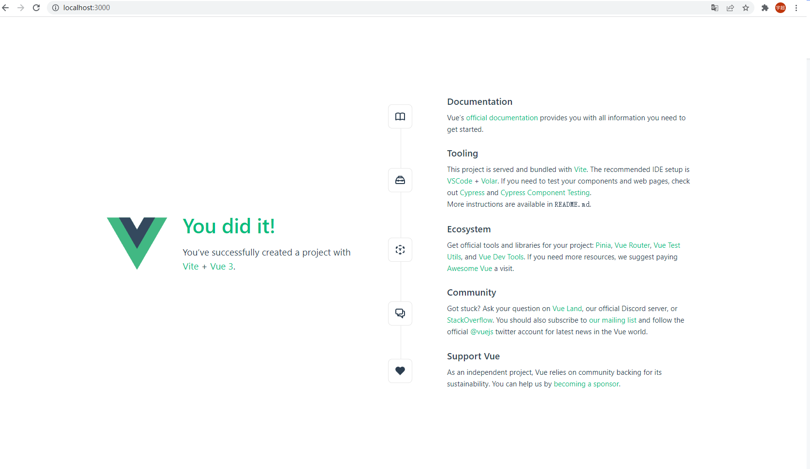

## 如何使用搭建Vue项目

### 1、环境准备

​	1）Node（尽量选择稳定版本），下载地址：https://nodejs.org/zh-cn/download/

​	2）IDE，推荐使用Visual Studio Code + Volar插件（在vscode中的插件市场搜索）。这个可以选择最新版，且免费。

​	3）浏览器。推荐谷歌浏览器最新版。

### 2、使用Vite创建项目。（详细参考：Z:\教程管理\前端教程\前端项目创建及引用UI库步骤详解.doc）

​	1）打开命令行，进入到你存放项目文件的相应目录。

​	2）在命令行中输入 npm init vue@3，通过一系列步骤之后，就会帮助你创建一个vue3版本的vue项目。(选项通过键盘左右方向键调整)

​		ps:简述一下每个选项大概什么意思

​		(1)   输入你的项目名称。不要出现中文，不要有空格或其他奇怪的特殊字符。

​		(2)   是否需要添加TypeScript。选择no。

​		(3)   是否需要JSX支持。选择no

​		(4)   是否需要添加路由。选择yes。

​		(5)   是否添加状态管理。选择yes。

​		(6)   Vitest测试工具，选择no。

​		(7)   Cypress 测试工具，选择no。

​		(8)   ESLint JavaScript代码检测工具。选择yes

​	 （9）是否添加Prettier作为格式化工具。选择yes


​	3）项目创建成功后，cd 进入 刚刚创建的目录，依次执行

```
npm install
npm run dev
```

  

​	4）在浏览器地址栏输入http://localhost:3000/ 则可以正常访问项目



### 3、引入Quasar或ElementUI

###### 注意： 我们项目组目前优先使用Quasar插件，如果某些需求无法满足再考虑引入ElementUI组件

####  Quasar

(1)   打开命令行工具，进入到项目的根目录

(2)   执行以下命令 npm install quasar @quasar/extras

(3)   执行以下命令 npm install -D @quasar/vite-plugin [sass@1.32.0](mailto:sass@1.32.0)


(4)   在IDE中打开项目文件夹。打开 src/main.js 进行编辑。


(5)   在IDE中打开项目文件夹。编辑根目录下的 vite.config.js


 

(6)   在 src文件夹下新增 quasar-variabless.sass文件，添加如下代码。


 

至此，QuasarUI库引入完成，可以正常在页面中使用组件。由于UI库会不断更新，具体操作细节可以查看官方文档 https://quasar.dev/start/vite-plugin

 

####  Element-Plus

(1)   打开命令行工具，进入到项目的根目录

(2)   执行如下命令 npm install element-plus --save

(3)   在IDE中打开项目文件夹。打开 src/main.js 进行编辑。


至此，Element-Plus库引入完成，可以正常在页面中使用组件

 


